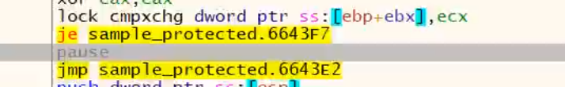
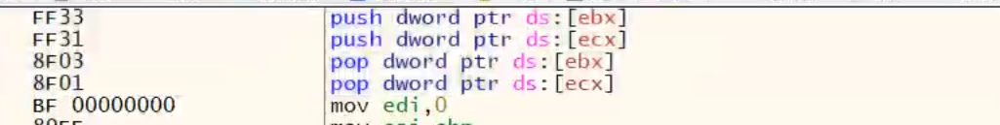
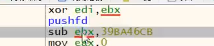
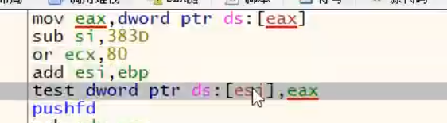
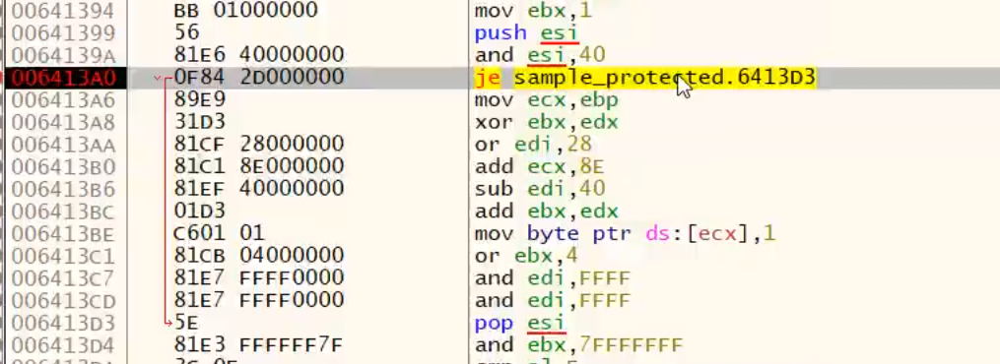

Themida

1.  Encrypt Strings in VM macros

    1.  这种是TMD保护字符串的设计

    2.  只要用SDK把字符串进行包裹之后才会对特定的字符串进行保护，前提这个选项必须打开

污点分析(taint analysis)

污点分析是目前比较泛用的一种数据追踪方法

污点就是比如输入正确的密码与输入错误的密码，到达比对那个一个点之后，eax的返回值的不同的，所以认为eax这个寄存器的值是有污染的，这个污染就是根据我的输入不同eax
的取值就不同，后面又把这个污染的值保存在一些列寄存器，比如mov
[esp],eax，所以需要追踪所有被污染过的寄存器和内存(追踪所有对污染的使用)，追踪到污染的最后使用一定会影响到一个位，这个位很可能就是VJCC（这个位可能产生一个分支）

在栈里下断点，不能下软件断点，下内存访问断点会涉及到页保护，执行效率会非常慢

此时执行到最后可能就是把之前的环境进行保存，此时在栈里面存在一个eax的值，在栈里面更改这个eax的值也能实现爆破的效果！此时原eax已经被(破坏)，所以需要跟踪栈的eax值

此时栈里的那个eax就是污染源，需要对这个污染源进行跟踪分析，可以对这个栈的地址下一个硬件访问断点，因为后面一定会读！

TMD的Tergn虚拟机特点，lock cmpxchg dword ptr ss:[ebp+ebx],ecx
其实是一个重要的虚拟机进入入口的标志，加了指令前缀的lock，其实就是为了保证多线程安全，多线程执行两个虚拟机的函数，同时访问同一块内存，可能造成内存冲突最后奔溃，加了lock之后便可以解决这个问题

方式是比较ebp+ebx里面内存的第一个值，如果是1的话则虚拟机当前被占用，则je不跳转，进入pause进行等待，然后利用jmp跳出当前的虚拟机！(多线程安全的考虑)

具体分析污染过程：

Eax [esp+imm] esi
[edx]，此时应该判断esi后面有没有被破坏，如果被破坏了则esi就不是污染源了，此时污染源为[esp+imm]，[edx]

虚拟机寄存器轮转，交换两个内存的值，此时交换内存之后，另外一个交换的内存就是污染源了，所以要追踪另外一个被交换过的内存

经过连续追踪，之前下的一个栈的硬件断点被实现了，经过了pushfd
此时的值可能就没用；了，所以可以对他进行删除！

经过连续污染分析之后追踪到一个test比较命令，这一步可能就很重要了，可能是改变分支流程的那个跳转，这时候可以对pushfd产生的栈下硬件访问进行跟踪，此时eax也是被污染过的寄存器，所以还要跟踪结合eax

下硬件4字节断点必须保持内存地址4字节对齐，比如0 4 8
C地址对齐，如果出现了不对齐的状态则只能下硬件1字节断点，否则硬下可能会出现没有对齐

最终经过反复跟踪，发现最后把之前test对比的eflags然后与esi进行对比，下面的je就是关键跳了，改变标志位让他继续执行

总结：污点分析

被污染的数据：在代码执行的指定时间点上，因输入的数据的不同而可能产生不同的取值睡觉

被污染的一般规则

1.  在一条指令中，如果有至少一个读位置是污染的，就将所有的写位置污染

2.  在一条指令中，如果所有的读位置都是非污染的，就将所有的写位置去污染

分支关键点特征：流向eip的污染

Eip的意思是因你输入的不同，最后指令流程发送改变

Vmp的做法是吧jcc都隐藏起来，而tmd的做法是增加一堆假的混淆的jcc给你，如果能找到那一个关键的点，那就爆破了！但是面临复杂一点的虚拟机，来回乱转的虚拟机，可能手动追踪过程就变成非常复杂，甚至不可完成！所以需要实现一款污点分析的全自动化工具！
